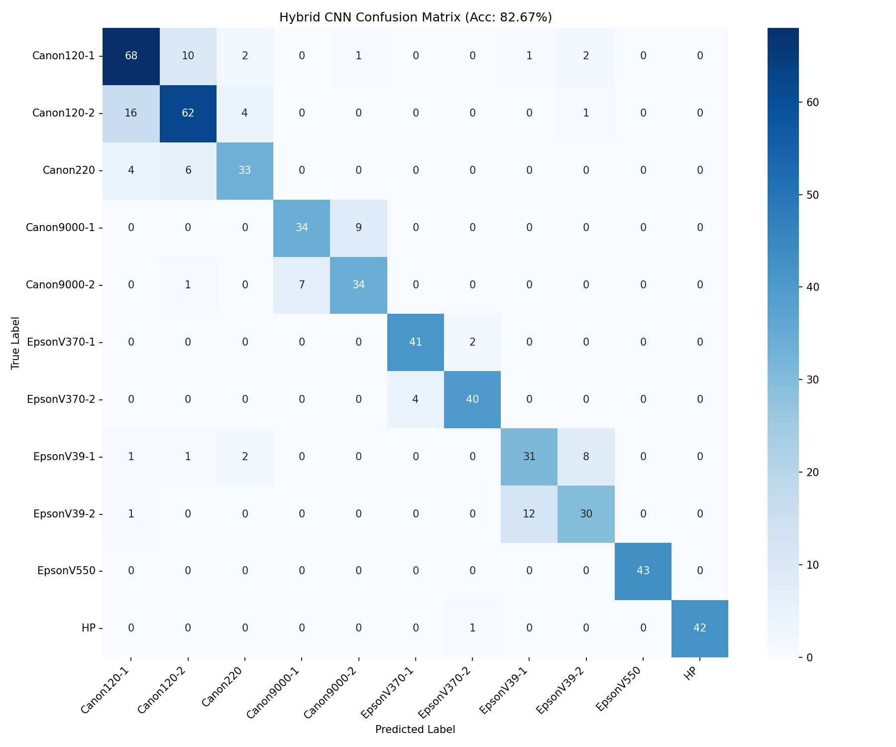
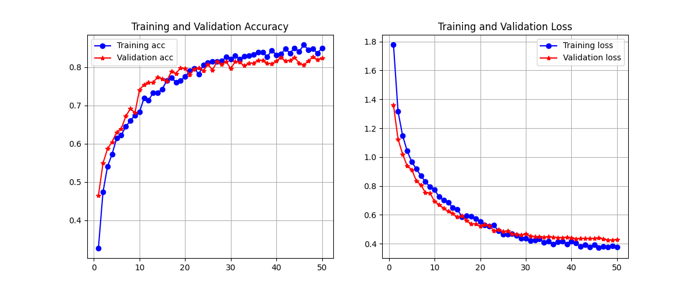

<!-- Animated Header -->
<p align="center">
  
</p>

<!-- Badges Row 1 -->
<p align="center">
  
  
  
  
</p>

<!-- Badges Row 2 -->
<p align="center">
  
  
  
  
</p>

<!-- Quick Links -->
<p align="center">
  <a href="https://huggingface.co/spaces/askvs/tracefinder"></a>
  <a href="#-key-features"></a>
  <a href="#-how-it-works"></a>
  <a href="#-model-performance"></a>
  <a href="#-installation"></a>
</p>

---

## 🎯 What is TraceFinder?

<table>
<tr>
<td width="70%">

**TraceFinder** is a cutting-edge forensic tool that answers one critical question:

> *Which scanner was used to create this document?"*

Every scanner leaves behind a unique **digital fingerprint** — subtle noise patterns, sensor artifacts, and frequency signatures that are invisible to the naked eye but detectable by AI.

TraceFinder exploits these microscopic traces to identify the exact make and model of the source scanner.

</td>
<td width="30%" align="center">

<br><br>
<br><br>


</td>
</tr>
</table>

### 💼 Use Cases

<table>
<tr>
<td align="center" width="50%">

### 🕵️ Digital Forensics


Determine which scanner was used to forge, duplicate, or originate legal documents.

</td>
<td align="center" width="50%">

### ⚖️ Legal Verification


Verify that court-submitted scanned documents came from authorized, known devices.

</td>
</tr>
</table>

---

## ✨ Key Features

<table>
<tr>
<td align="center" width="25%">

### 🧠
**Hybrid CNN**
<br>
<sub>Deep residual learning + handcrafted features</sub>

</td>
<td align="center" width="25%">

### 📉
**PRNU Analysis**
<br>
<sub>Photo-Response Non-Uniformity fingerprinting</sub>

</td>
<td align="center" width="25%">

### 🌊
**FFT + Wavelet**
<br>
<sub>Frequency domain forensics</sub>

</td>
<td align="center" width="25%">

### 🔍
**Grad-CAM**
<br>
<sub>Explainable AI visualization</sub>

</td>
</tr>
</table>

---

## 🚀 How It Works

<!-- Pipeline Badges -->
<p align="center">
  
  
  
  
  
  
  
  
  
</p>

<!-- Pipeline Cards -->
<table>
<tr>
<td align="center" width="20%">

<br><br>
<b>📄 INPUT</b>
<br><br>
Upload scanned document
<br>
<code>JPG</code> <code>PNG</code> <code>TIFF</code>
</td>
<td align="center" width="20%">

<br><br>
<b>⚙️ PREPROCESS</b>
<br><br>
Grayscale → Resize → Wavelet Denoise
</td>
<td align="center" width="20%">

<br><br>
<b>📊 EXTRACT</b>
<br><br>
Noise residual + 44 forensic features
</td>
<td align="center" width="20%">

<br><br>
<b>🧠 CLASSIFY</b>
<br><br>
Hybrid CNN / SVM / Random Forest
</td>
<td align="center" width="20%">

<br><br>
<b>✅ OUTPUT</b>
<br><br>
Scanner ID + Confidence %
</td>
</tr>
</table>

### 🔬 44 Forensic Features Extracted

<table>
<tr>
<td align="center" width="25%">

**🌊 Wavelet Residual**

Haar L1 decomposition extracts scanner-specific noise

</td>
<td align="center" width="25%">

**📈 FFT Spectrum**

3 frequency bands (Low/Mid/High energy)

</td>
<td align="center" width="25%">

**🔲 LBP Texture**

26-bin histogram from 24-neighbor pattern

</td>
<td align="center" width="25%">

**📍 PRNU Correlation**

11 scanner fingerprint similarity scores

</td>
</tr>
</table>

---

## 📊 Model Performance

<table>
<tr>
<td align="center">

</td>
</tr>
</table>

<table>
<tr>
<td width="50%">

### 📈 Per-Class Results

| Scanner | Precision | Recall | F1 |
|---------|:---------:|:------:|:--:|
| Canon120-1 | 0.80 | 0.81 | 0.81 |
| Canon120-2 | 0.66 | 0.74 | 0.70 |
| Canon220 | 0.73 | 0.77 | 0.75 |
| Canon9000-1 | 0.69 | 0.79 | 0.74 |
| Canon9000-2 | 0.61 | 0.81 | 0.70 |
| EpsonV370-1 | 0.87 | 0.95 | 0.91 |
| EpsonV370-2 | 0.87 | 0.91 | 0.89 |
| EpsonV39-1 | 0.61 | 0.74 | 0.67 |
| EpsonV39-2 | 0.75 | 0.70 | 0.72 |
| **EpsonV550** | **1.00** | **1.00** | **1.00** |
| **HP** | **1.00** | **1.00** | **1.00** |

</td>
<td width="50%">

### 🎯 Confusion Matrix


</td>
</tr>
</table>

### 📈 Training Progress

<p align="center">

</p>

---

## 🛠️ Models Included

<table>
<tr>
<td align="center" width="25%">
<br><br>
<b>TensorFlow</b><br>
<sub>Highest accuracy</sub><br>
<code>~12 MB</code>
</td>
<td align="center" width="25%">
<br><br>
<b>PyTorch</b><br>
<sub>Fast inference</sub><br>
<code>~64 MB</code>
</td>
<td align="center" width="25%">
<br><br>
<b>Scikit-learn</b><br>
<sub>100 trees</sub><br>
<code>~2 MB</code>
</td>
<td align="center" width="25%">
<br><br>
<b>Scikit-learn</b><br>
<sub>RBF kernel</sub><br>
<code>~1 MB</code>
</td>
</tr>
</table>

---

## 🖥️ Live Demo

<!-- Try It Now Banner -->
<p align="center">
  <a href="https://huggingface.co/spaces/askvs/tracefinder" target="_blank">
    
  </a>
</p>

<table>
<tr>
<td align="center" colspan="2">

### 🌐 Deployed on Hugging Face Spaces

<p align="center">
  <a href="https://huggingface.co/spaces/askvs/tracefinder" target="_blank">
    
  </a>
  <a href="https://huggingface.co/spaces/askvs/tracefinder" target="_blank">
    
  </a>
  <a href="https://huggingface.co/spaces/askvs/tracefinder" target="_blank">
    
  </a>
</p>

<br>

<p align="center">
<b>👉 <a href="https://huggingface.co/spaces/askvs/tracefinder">Click here to launch TraceFinder</a> 👈</b>
</p>

<p align="center">
<sub>No installation needed — just upload an image and get instant scanner identification!</sub>
</p>

</td>
</tr>
</table>

<br>

<table>
<tr>
<td>

### ✨ App Features

- 🎨 **Modern dark theme** with gradient accents
- 📤 **Drag & drop** image upload
- 🧪 **Sample images** for quick testing
- 📊 **Real-time** probability charts
- 🔍 **Grad-CAM** explainability

</td>
<td>

### 🚀 Run Locally

```bash
streamlit run landing_page.py
```

Then open: `http://localhost:8501`

</td>
</tr>
</table>

---

## 📦 Installation

<table>
<tr>
<td>

### Prerequisites


</td>
</tr>
</table>

```bash
# Clone the repository
git clone https://github.com/askvs/TraceFinder.git
cd TraceFinder

# Create virtual environment
python -m venv venv
venv\Scripts\activate  # Windows
# source venv/bin/activate  # Linux/Mac

# Install dependencies
pip install -r requirements.txt
```

---

## 🚀 Usage

### Run the Web Application

```bash
# Activate virtual environment
venv\Scripts\activate

# Launch the app
streamlit run landing_page.py
```

### Available Models

| Model | Best For |
|:-----:|:---------|
| 🧠 **Hybrid CNN** | Highest accuracy (recommended) |
| 🔬 **Standalone CNN** | Fast deep learning inference |
| 🌲 **Random Forest** | Quick baseline analysis |
| ⚡ **SVM** | Lightweight classification |
| 🔍 **Grad-CAM** | Visual explainability |

---

## 📁 Project Structure

```
TraceFinder/
│
├── 📄 landing_page.py          # Main Streamlit web application
├── 📄 model_inference.py       # Unified inference API for all models
├── 📄 requirements.txt         # Python dependencies
│
├── 📁 codes/
│   ├── 📁 baseline/
│   │   ├── train_baseline.py       # Train SVM & Random Forest
│   │   ├── evaluate_baseline.py    # Evaluate baseline models
│   │   ├── predict_baseline.py     # Prediction utilities
│   │   ├── models.py               # Model definitions
│   │   └── tuning.py               # Hyperparameter tuning
│   │
│   ├── 📁 cnn_model/
│   │   ├── model.py                # PyTorch CNN architecture
│   │   ├── dataset.py              # Dataset loader
│   │   ├── train.py                # Training script
│   │   └── evaluate.py             # Evaluation metrics
│   │
│   ├── 📁 hybrid_cnn/
│   │   ├── train_hybrid_cnn.py     # Train Hybrid CNN model
│   │   ├── eval_hybrid_cnn.py      # Evaluation with metrics
│   │   ├── gradcam.py              # Grad-CAM visualization
│   │   └── processing.py           # Feature preprocessing
│   │
│   ├── 📁 eda/
│   │   ├── eda_official.py         # EDA on official dataset
│   │   └── eda_wikipedia.py        # EDA on Wikipedia dataset
│   │
│   └── preprocess_combined.py      # Combined preprocessing pipeline
│
├── 📁 models/
│   ├── 📁 baseline/
│   │   ├── random_forest.joblib    # Trained Random Forest
│   │   ├── svm.joblib              # Trained SVM model
│   │   └── scaler.joblib           # Feature scaler
│   │
│   ├── 📁 cnn/
│   │   └── cnn_model.pth           # PyTorch CNN weights
│   │
│   └── 📁 hybrid_cnn/
│       ├── scanner_hybrid.keras    # Keras Hybrid CNN model
│       ├── hybrid_label_encoder.pkl
│       └── hybrid_feat_scaler.pkl
│
├── 📁 results/
│   ├── 📁 baseline/                # Confusion matrices
│   ├── 📁 cnn/                     # Training curves
│   ├── 📁 hybrid_cnn/              # Plots & Grad-CAM
│   └── 📁 eda/                     # EDA visualizations
│
└── 📁 samples/                     # Test images (8 scanners)
    ├── Canon120-1_sample.jpg
    ├── Canon9000-1_sample.jpg
    ├── EpsonV370-1_sample.jpg
    ├── EpsonV550_sample.jpg
    ├── HP_sample.jpg
    └── ...
```

---

## 🔬 Technical Details

### Preprocessing Pipeline

| Step | Process | Details |
|:----:|:--------|:--------|
| 1 | Grayscale | Remove color information |
| 2 | Resize | Standardize to 256×256 |
| 3 | Wavelet | Haar L1 denoising |
| 4 | Residual | `Original - Denoised = Noise` |

### Supported Scanners

<table>
<tr>
<td align="center"></td>
<td align="center"></td>
<td align="center"></td>
<td align="center"></td>
</tr>
<tr>
<td align="center"></td>
<td align="center"></td>
<td align="center"></td>
<td align="center"></td>
</tr>
<tr>
<td align="center"></td>
<td align="center"></td>
<td align="center"></td>
<td align="center"></td>
</tr>
</table>

---

## 🤝 Contributing

Contributions are welcome! Please feel free to submit a Pull Request.

---

## 📜 License

This project is licensed under the Infosys License.

---


<p align="center">
  <b>TraceFinder</b> — Where every scan leaves a trace 🔍
</p>

<p align="center">
  Made with ❤️ by Vikash Sharma for Digital Forensics
</p>
<!-- Footer -->
<p align="center">
  
</p>
